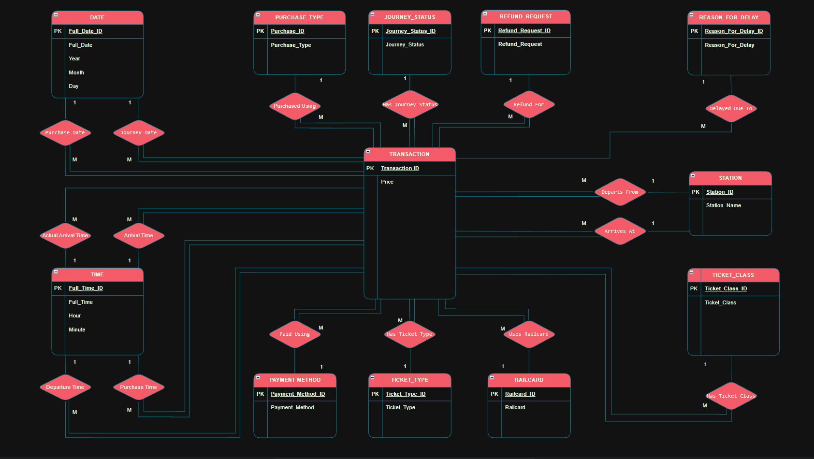
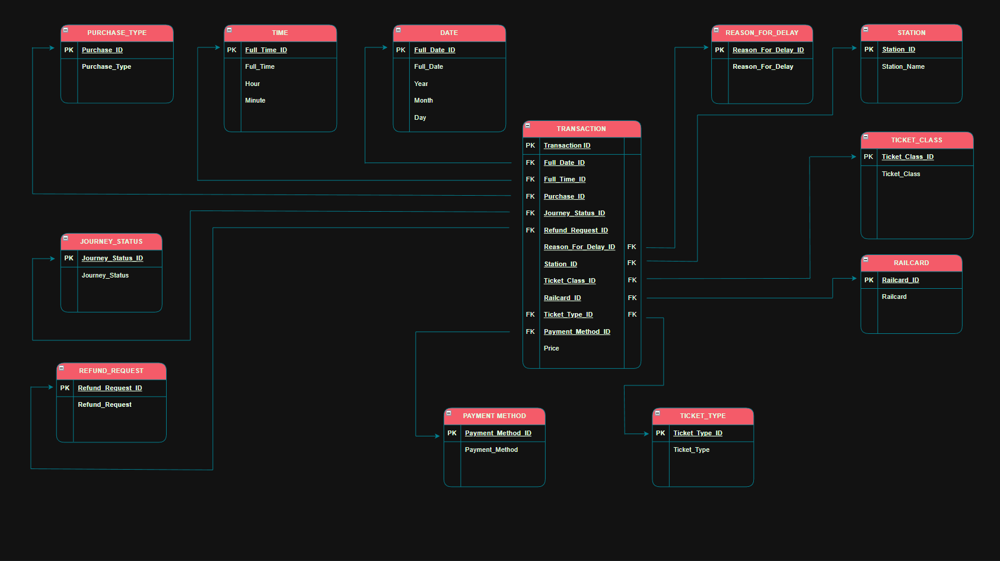
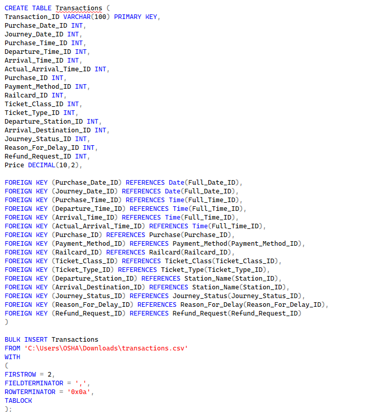
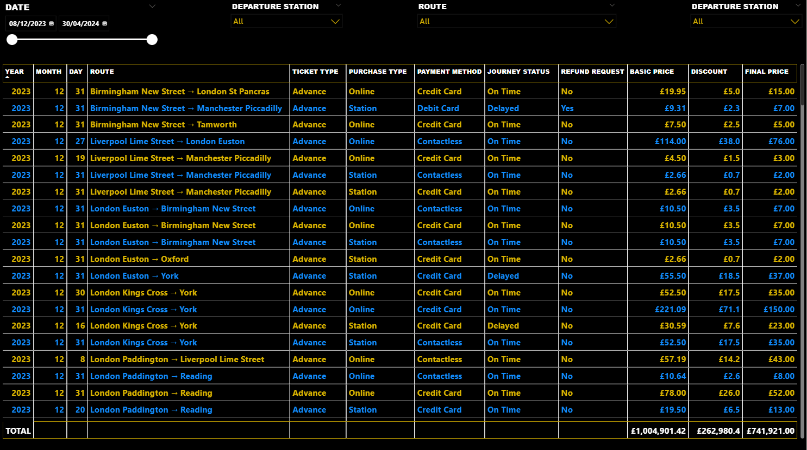
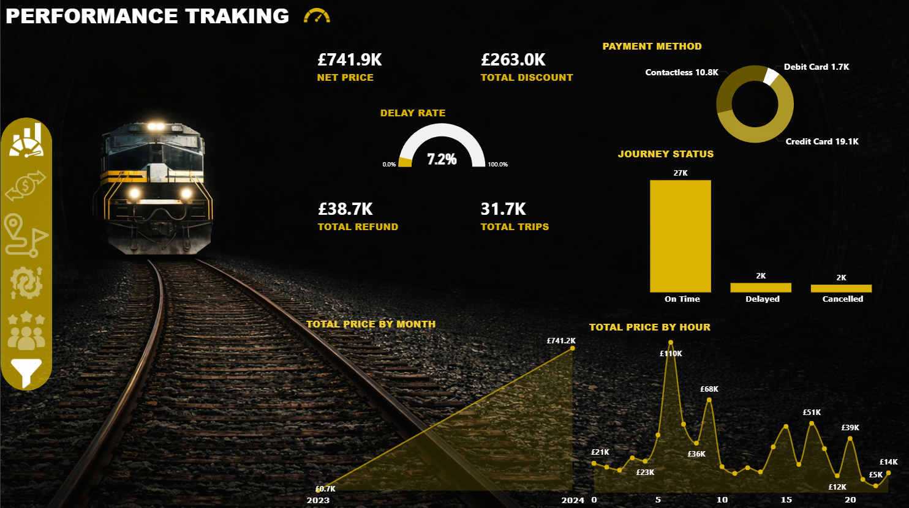
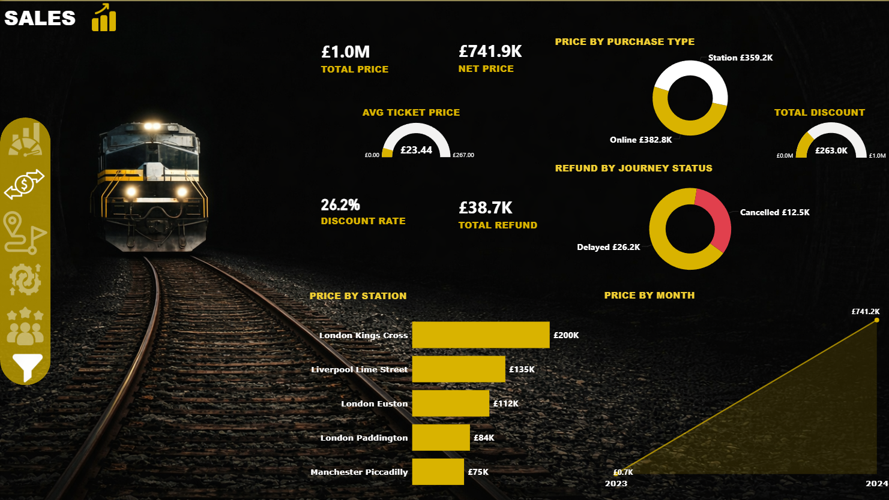
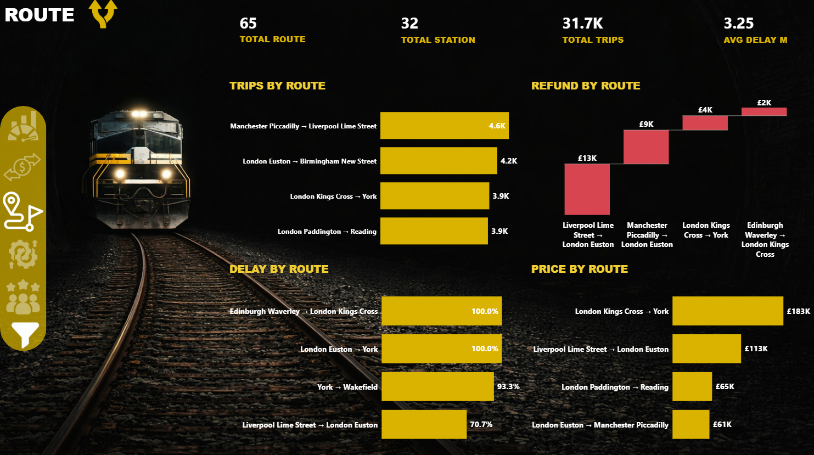
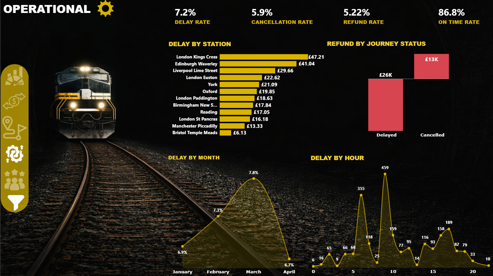
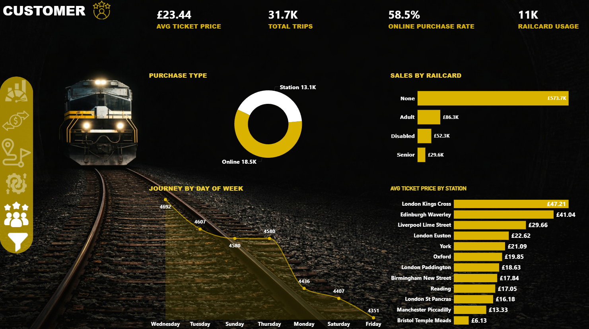

# 🚆 UK Train Rides Analytics Dashboard

End-to-end data analysis project covering data cleaning, modeling, SQL, and interactive dashboards using Power BI.

---

## 📊 Project Overview

This project analyzes UK train ride transactions to uncover insights about sales performance, customer behavior, delays, and operational efficiency.

---

## 🧩 Data Modeling

### 🔹 ERD (Entity Relationship Diagram)

This ERD represents the overall structure of the database, showing the relationships between key entities such as transactions, stations, ticket types, and payment methods. It ensures proper data organization and supports efficient querying.

---

### 🔹 Schema Mapping

The schema mapping translates the ERD into actual database tables with defined primary and foreign keys. It ensures data integrity and enables efficient joins across all related tables.

---

### 🔹 SQL Implementation

SQL was used to create the database structure, define relationships, and perform data extraction and transformation. The queries support analysis by preparing clean and structured datasets.

---

### 🔹 Data Preview

This preview shows a sample of the dataset after cleaning and transformation. It includes key fields such as route, ticket type, payment method, and pricing, ready for analysis.

---

## 📈 Dashboard Insights

### 🔹 Performance Overview

This dashboard provides a high-level overview of business performance, including total revenue, total trips, delay rate, and refunds. It helps monitor overall system efficiency and key performance indicators.

---

### 🔹 Sales Analysis

This section analyzes revenue performance, highlighting total sales, average ticket price, and the impact of discounts and purchase channels on revenue.

---

### 🔹 Route Analysis

This analysis focuses on route performance, identifying the most active routes, revenue distribution, and routes with high delays or operational issues.

---

### 🔹 Operational Analysis

This dashboard evaluates operational efficiency, including delay rate, cancellation rate, and delay patterns across time and stations.

---

### 🔹 Customer Insights

This section analyzes customer behavior, including purchase patterns, railcard usage, and variations in pricing across customer segments.

---

## 🛠 Tools & Technologies

* Excel (Data Cleaning & Preparation)
* SQL Server (Database Design & Queries)
* Power BI (Data Visualization & Dashboarding)

---

## 🚀 Conclusion

This project demonstrates an end-to-end data analysis workflow, from raw data cleaning and database design to building interactive dashboards that generate actionable insights.
